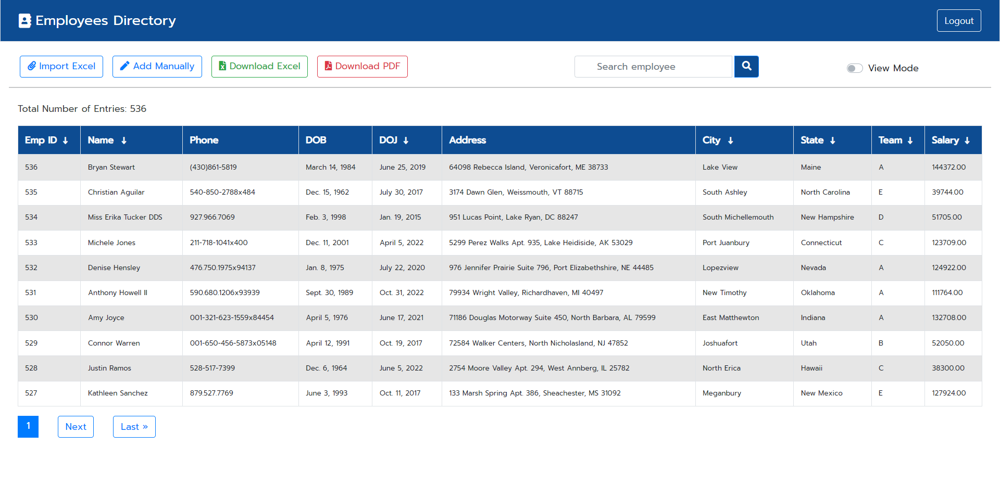
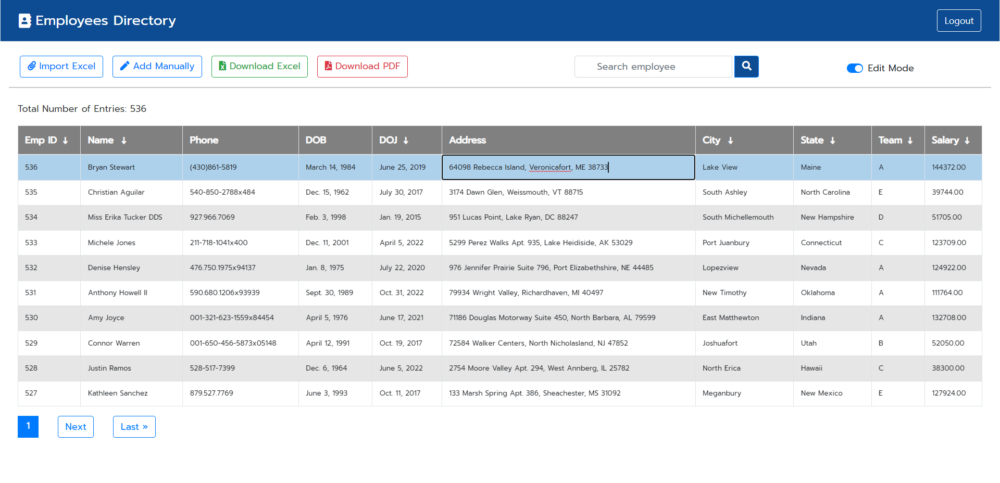

# Employee Directory Web Application

The Employee Directory Web Application is a simple web-based tool that allows users to manage and view a list of employees. It provides features for importing employees from an Excel file, adding employees manually, and searching for specific employees. Users can also edit employee details and download the employee list in Excel and PDF formats.


##Screenshots





## Features

- Import Employees: Users can upload an Excel file containing employee details to add multiple employees at once.
- Manual Entry: Users can add individual employees manually through a form.
- Search: Users can search for specific employees based on their names.
- Edit Mode: Users can switch between view and edit modes to modify employee details.
- Download: Users can download the list of employees in both Excel and PDF formats.

## Technologies Used

- Frontend: HTML, CSS, JavaScript
- Backend: Python (Django Framework)
- Database: SQLite (can be changed to other databases as per requirements)
- Excel Manipulation: Python's Pandas library
- PDF Generation: Python's ReportLab library

## How to Set Up the Project

1. Clone the repository to your local machine.

2. Install Python (if not already installed) from https://www.python.org/.

3. Create a virtual environment for the project to manage dependencies. Run the following commands:

```bash
# On Windows
python -m venv venv
venv\Scripts\activate

# On macOS and Linux
python3 -m venv venv
source venv/bin/activate
```

4. Install required Python packages using pip:

```bash
pip install -r requirements.txt
```

5. Apply the database migrations:

```bash
python manage.py migrate
```

6. Start the development server:

```bash
python manage.py runserver
```

7. Access the web application in your browser at http://localhost:8000/.

## Usage

1. Home Page: The home page displays a list of employees with their basic details such as ID, Name, Phone, Date of Birth, Date of Joining, Address, City, State, Team, and Salary. Employees are displayed in a paginated table format.

2. Import Employees: Click the "Import Excel" button to upload an Excel file containing employee details. The application will read the data from the Excel file and add the employees to the database.

3. Manual Entry: Click the "Add Manually" button to add a single employee manually. Fill out the required employee details in the form and click "Add New Employee."

4. Search: Use the search bar to find employees by their names. Enter the name in the search bar and click the search icon to view the filtered results.

5. Edit Mode: Toggle the switch labeled "View Mode" to switch between view and edit modes. In view mode, employee details are not editable. In edit mode, employee details can be modified directly in the table.

6. Download: Use the "Download Excel" and "Download PDF" buttons to download the list of employees in Excel and PDF formats, respectively.

## Notes

- The application currently uses SQLite as the default database. For production use, consider using a more robust database like PostgreSQL or MySQL.

- The application does not include authentication or user management. For production deployment, implement user authentication and access control.

- To enhance security, restrict file upload to trusted users only, and validate the uploaded files before processing.

- Ensure that the required CSS files and font resources are available in the 'static' folder.

- Customize the 'base.html' template to include a consistent header, footer, and navigation menu for all pages.

## Contribution

This project is open for contributions. Feel free to open issues, suggest improvements, or submit pull requests.

## License

This project is licensed under the MIT License. See the LICENSE file for details.

## Acknowledgments

- This project was inspired by the need for a simple employee directory management system.
- Thanks to the Django community for providing a robust web framework.
- Thanks to the developers of Python's Pandas and ReportLab libraries for their excellent tools.
